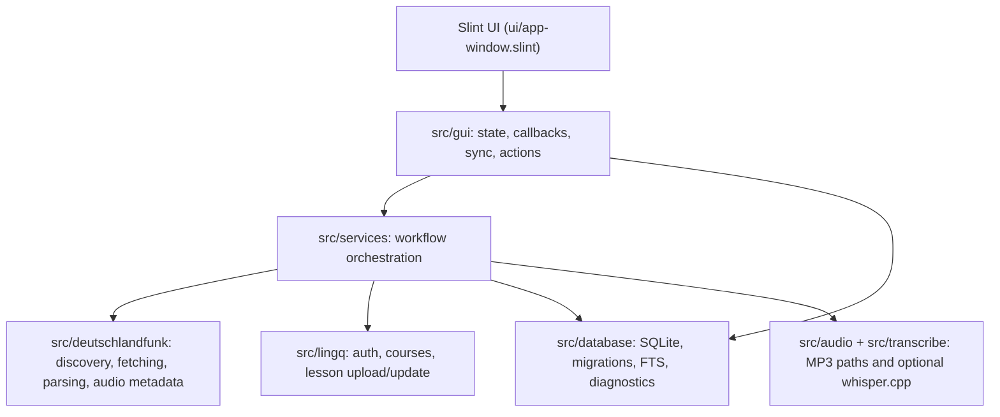

# Architecture

DLF LingQ Reader is GUI-first. `src/main.rs` starts the Slint app; workflows
live below the GUI boundary so parsing, storage, uploads, audio, and
transcription can be tested without launching a window.

## Boundaries

- `gui` owns UI state, event callbacks, dirty syncing, and user-facing status.
- `services` owns multi-step operations such as save-with-audio, LingQ upload,
  and transcription.
- `deutschlandfunk` owns network fetch throttling, short-lived browse/search
  caching, HTML parsing, text normalization, and audio metadata extraction.
- `database` owns migrations, indexes, backup, upload status, sync events,
  health checks, and exports.
- `diagnostics` builds redacted health reports and support bundles.

## Reliability Defaults

- GUI background jobs run through a bounded limiter so bulk work cannot saturate
  the runtime.
- Deutschlandfunk requests are rate-limited and concurrency-limited.
- Browse/search discovery results are cached briefly to avoid refetching the
  same section during quick UI interactions.
- LingQ uploads record `pending`, `uploading`, `failed`, and `succeeded` state
  in SQLite.
- Audio upload paths are validated before LingQ requests are sent.

## Compatibility

Public branding is `DLF LingQ Reader`, but the package, executable, database,
and app-data folder remain `deutschlandfunk_lingq_tool` for existing users.
